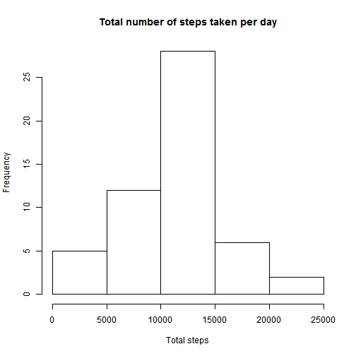
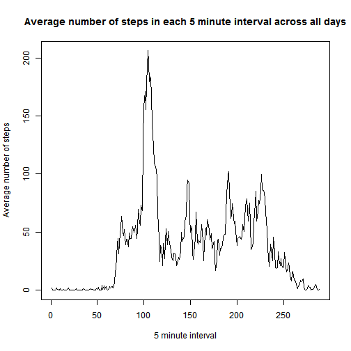
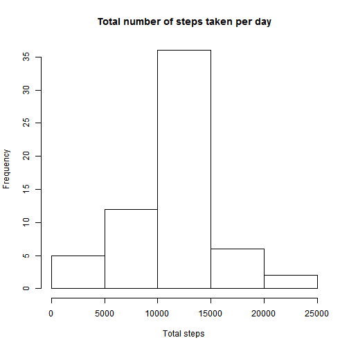
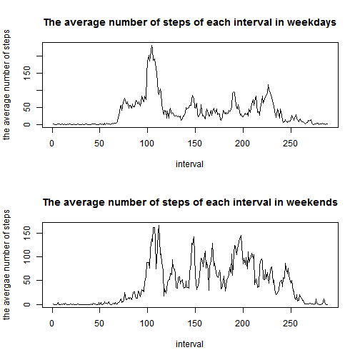

#Introduction
* **This document is for the first assignment of Reproducable Research Course on Coursera. It is based on a dataset of activity of monitoring.**

#Loading and processing the data
* Use *read.csv* function to load the data, and remove the rows with Na Value

```r
act_data <- read.csv('activity.csv')
act_sub1 <- act_data[!is.na(act_data$steps),]
```
# Mean total number of steps taken per day
* Use *tapply* function to calculate the total number of steps taken per day

```r
steps_pday <-tapply(act_sub1$steps, act_sub1$date, sum)
```
* Make a histogram of the total number of steps taken each day

```r
hist(steps_pday, main = "Total number of steps taken per day", xlab = "Total steps")
```

 

* Calculate the mean and median of the total number of steps taken per day.

```r
ave_steps <- mean(steps_pday[!is.na(steps_pday)])
median_steps <- median(steps_pday, na.rm = T)
ave_steps
```

```
## [1] 10766.19
```

```r
median_steps
```

```
## [1] 10765
```
* The mean is 1.0766189 &times; 10<sup>4</sup>, and the median is 10765.

# The average daily activity pattern
* Use *tapply* funciton to calculate the avergae steps of each interval accross all the days, and then make a time siries plot.

```r
steps_inter <- tapply(act_sub1$steps, act_sub1$interval, mean)
plot(steps_inter, type = "l", xlab = "5 minute interval", ylab = "Average number of steps", main
     = "Average number of steps in each 5 minute interval across all days")
```

 

* Find the interval, which on average across all the days in the dataset contains the maximum number of steps. It is the 835 interval, and the mean is 206.1698113.

```r
names(steps_inter[steps_inter == max(steps_inter)])
```

```
## [1] "835"
```

# Imputing missing values

* Calculate the total number of missing values in the dataset.

```r
num_na <- sum(is.na(act_data$steps))
```
* There are 2304 missing values.
* Choose the he mean for each 5-minute interval to fill in the missing values. Use 
for loops to flling in all of the missing values in the dataset. 

```r
for (i in 1:nrow(act_data)){
  if (is.na(act_data[i,1])){
    act_data[i,1] <- steps_inter[match(act_data[i,3], names(steps_inter))]
  }
}
```
* Use *tapply* fucntion to calculate the total number of steps per day, make a histgram, and calculte the mean and median.

```r
steps_pday02 <-tapply(act_data$steps, act_data$date, sum)
hist(steps_pday02, main = "Total number of steps taken per day", xlab = "Total steps")
```

 

```r
ave_steps02 <- mean(steps_pday02)
median_steps02 <- median(steps_pday02)
ave_steps02
```

```
## [1] 10766.19
```

```r
median_steps02
```

```
## [1] 10766.19
```
* Compared to removing the missing values, the median and mean **change little**.

#  The differences in activity patterns between weekdays and weekends
* Use *as.Date* function to process the date, and use *weekdays* function and for loops to add the fourth column with two levels "Weekend" and "Weekday".

```r
act_data$date <- as.Date(act_data$date, "%Y-%m-%d")
weekdays <- weekdays(act_data$date)
for (i in 1:length(weekdays)){
  if (weekdays[i] == "Sunday" | weekdays[i] == "Saturday"){
    act_data[i,4] <- "Weekend"
  }else{
    act_data[i,4] <- "Weekday"
  }
}
colnames(act_data)[4] <- "weekdays"
act_data$weekdays <- as.factor(act_data$weekdays)
```

* Divide the dateset into two parts depending on the factor of weekday.

```r
act_weekday <- act_data[act_data$weekdays == "Weekday",]
act_weekend <- act_data[act_data$weekdays =="Weekend",]
```
* Use *tapply* to calcuate the average steps of each interval across all the days.

```r
steps_weekday <- tapply(act_weekday$steps, act_weekday$interval, mean)
steps_weekend <- tapply(act_weekend$steps, act_weekend$interval, mean)
```
* Make a panel to compare the average steps in weekdays and weenends.

```r
par(mfrow =c(2,1))
plot(steps_weekday, type= "l", xlab = "interval", ylab = "the average number of steps", main = "The average number of steps of each interval in weekdays")
plot(steps_weekend,type = "l", xlab = "interval", ylab = "the avergae number of steps", main = "The average number of steps of each interval in weekends")
```

 

* The main difference between weekdays and weekends is that, in the day time of weekends, the number of steps of each interval is **more than** that in the day time of weekdays. That is in weekends, the volunteer **make more steps in day time**.
